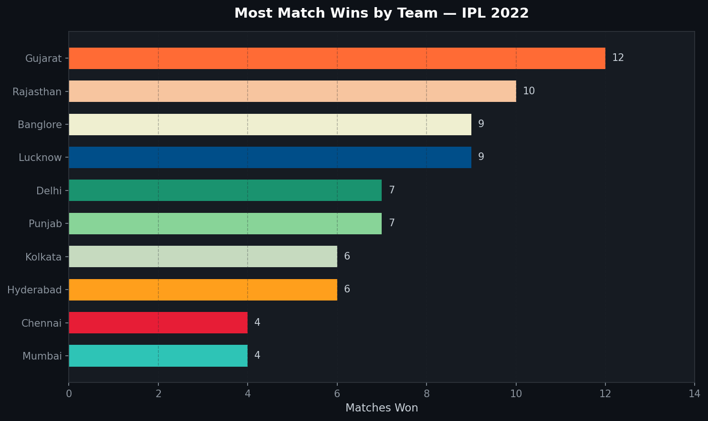
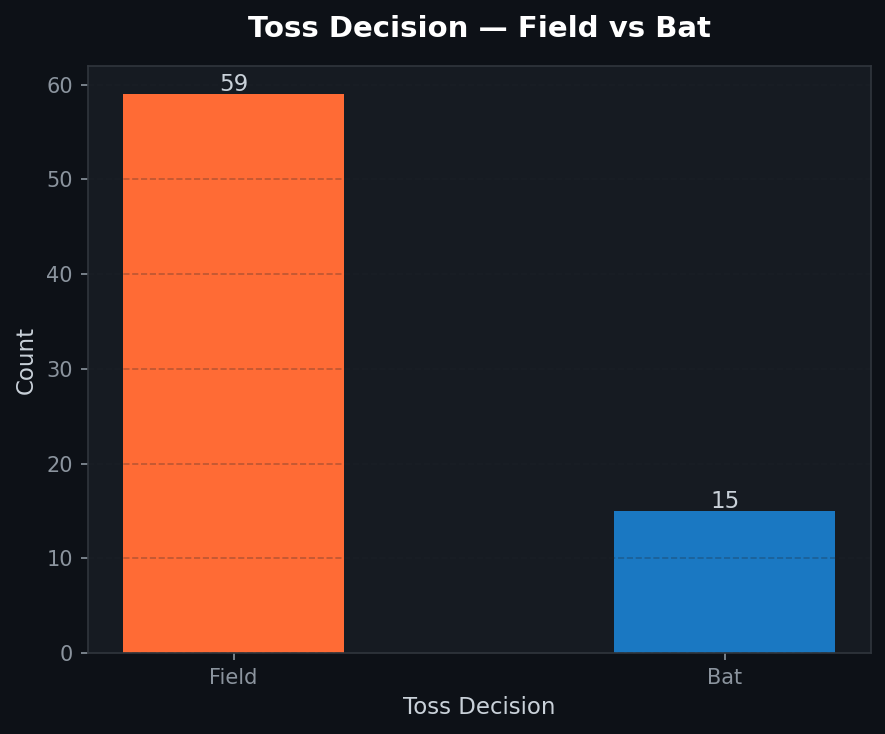
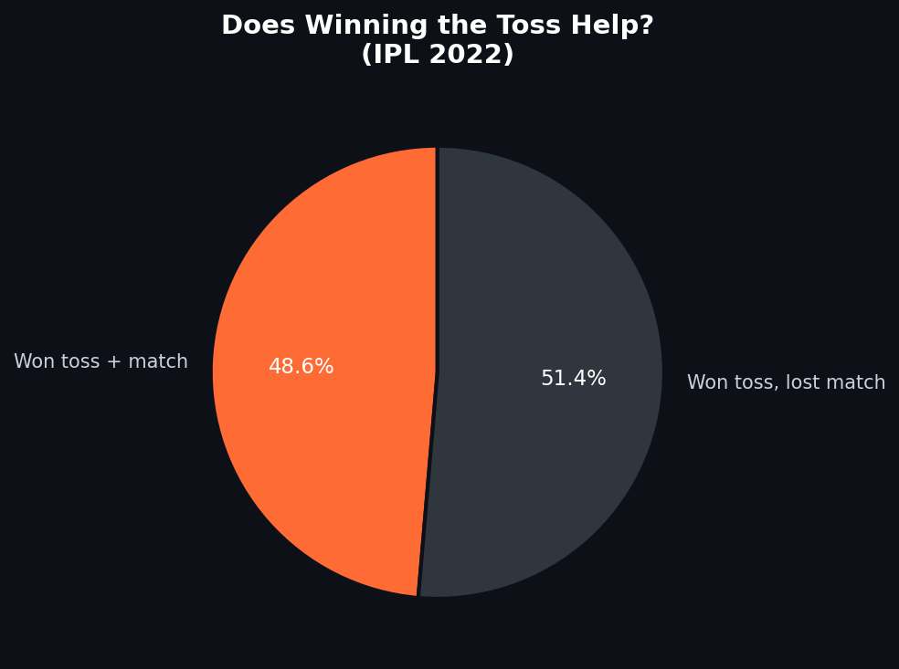
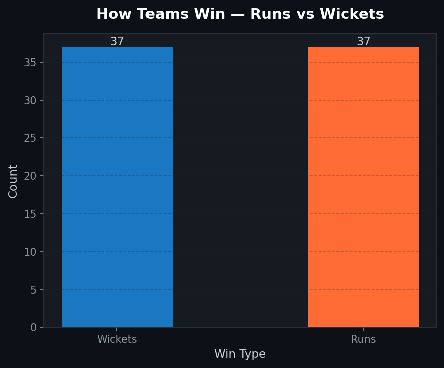
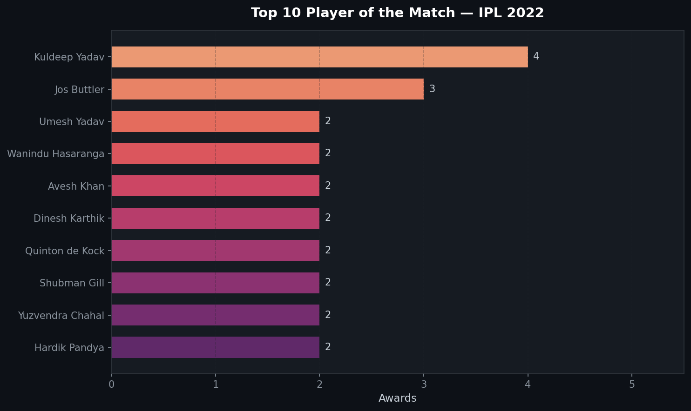
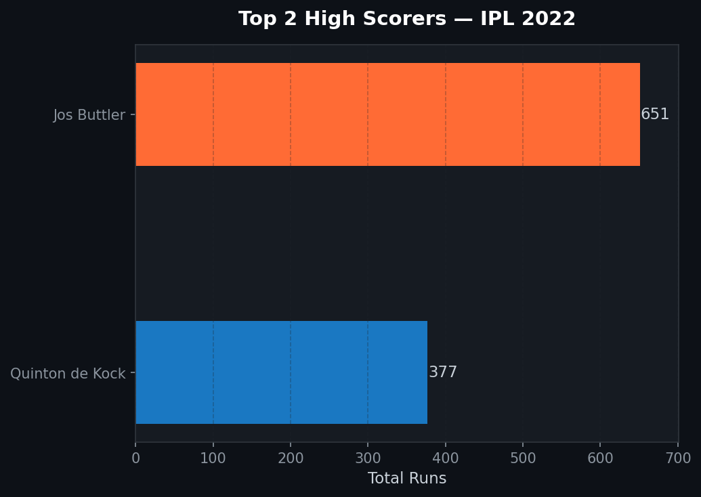

# 🏏 IPL 2022 — Match Data Analysis

Exploratory Data Analysis (EDA) on IPL 2022 season match data using Python.

---

## 📊 Charts & Insights

### 1. Most Match Wins by Team


### 2. Toss Decision — Field vs Bat


### 3. Does Winning the Toss Help?


### 4. How Teams Win — Runs vs Wickets


### 5. Top 10 Player of the Match Awards


### 6. Top 2 Run Scorers


---

## 🔍 Key Findings

- Winning the toss doesn't guarantee winning the match (~50% only)
- Most captains prefer **fielding first** after winning the toss
- Both batting and bowling win roughly equal number of matches
- A few players consistently dominated the Player of the Match awards

---

## 🛠️ Tech Stack

- Python | Pandas | Matplotlib | Seaborn | NumPy

---

## 🚀 How to Run

```bash
pip install pandas matplotlib seaborn numpy
python main.py
```
